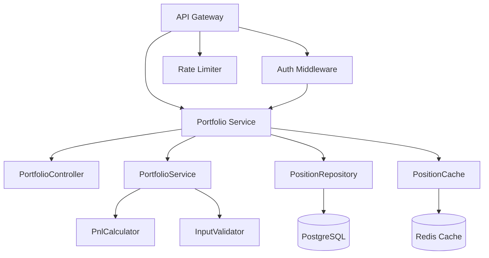
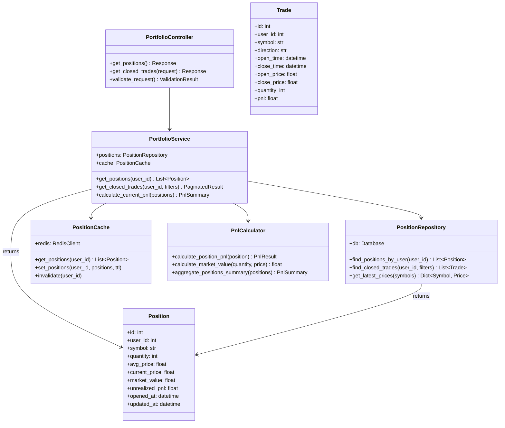
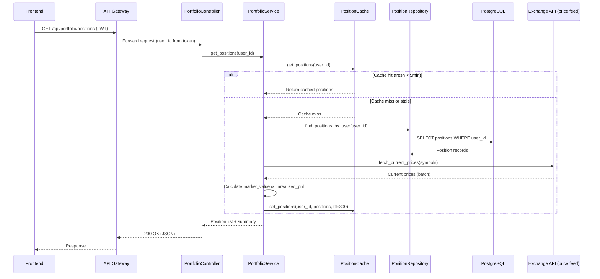
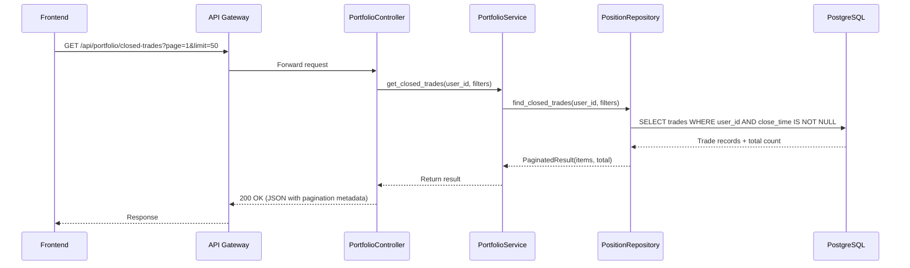
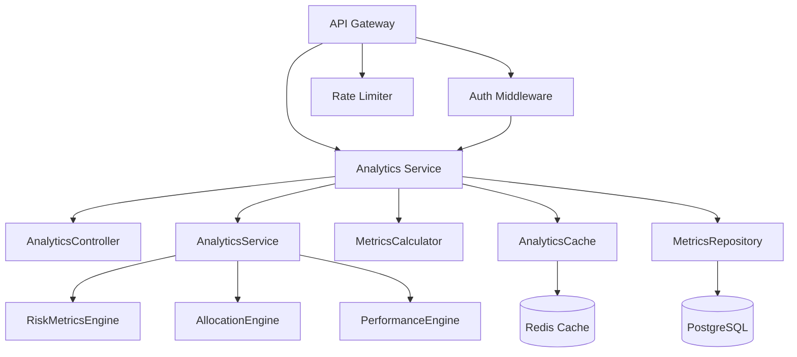
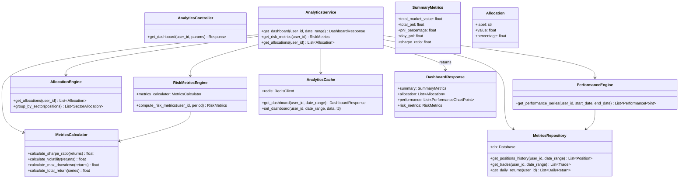
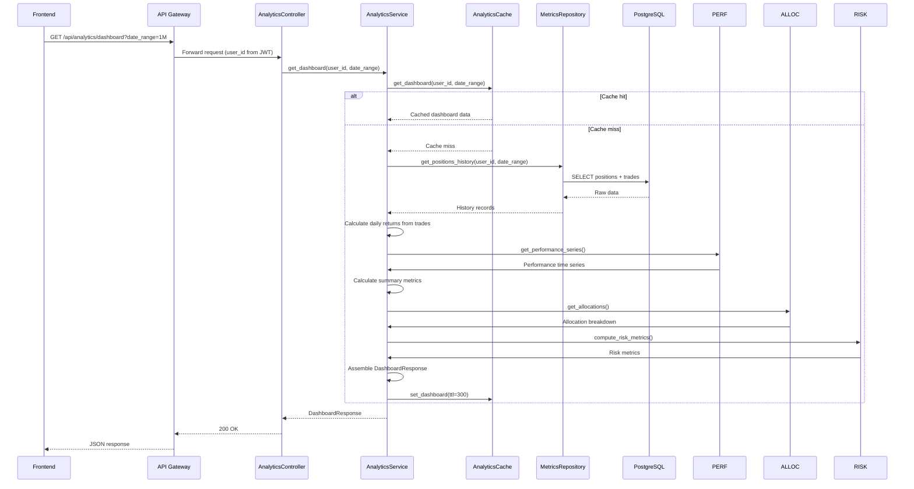
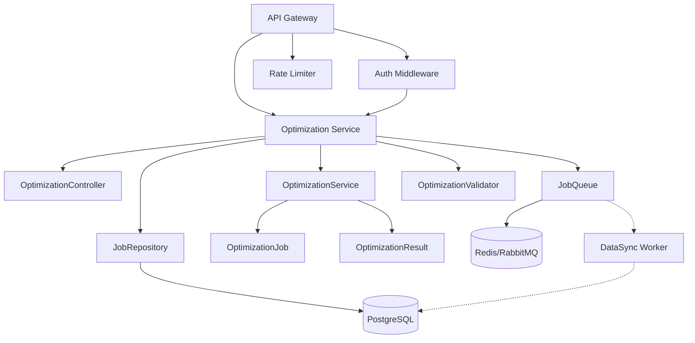
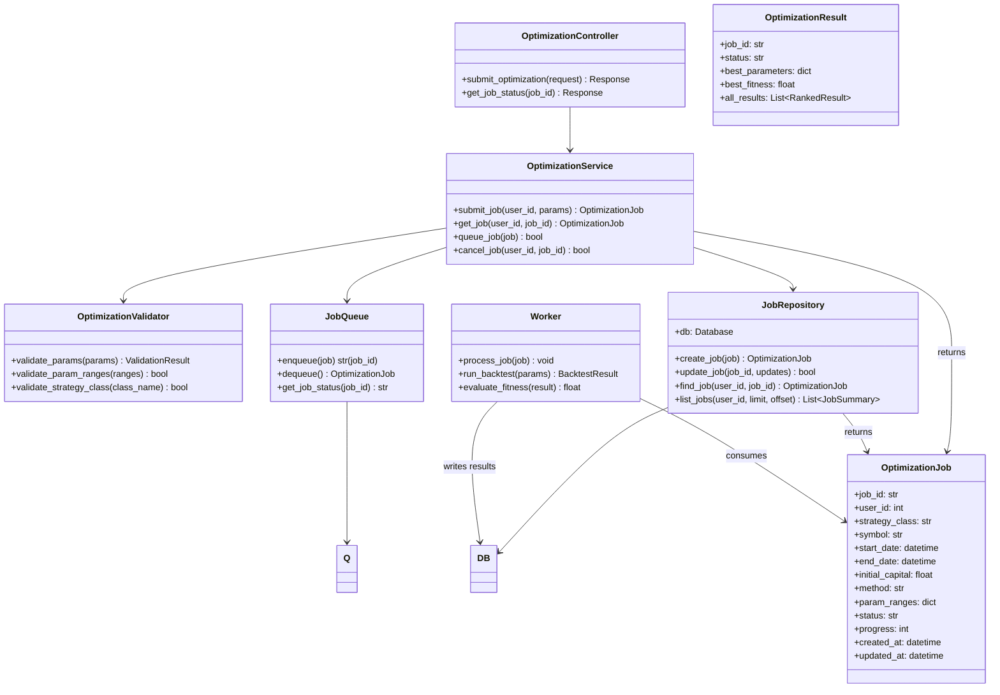
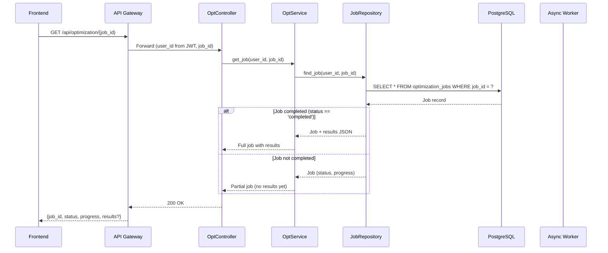

# Phase 7 V1 Component Specifications

**Version**: 1.0  
**Date**: 2026-03-09  
**Based on**: SYSTEM_ARCHITECTURE.md (Final)  
**Scope**: Portfolio Service (read-only), Analytics Service (dashboard), Optimization Service (submit+status)

---

## Table of Contents

1. [Overview](#overview)
2. [Portfolio Service](#portfolio-service)
3. [Analytics Service](#analytics-service)
4. [Optimization Service](#optimization-service)
5. [Shared Components](#shared-components)
6. [Error Handling Strategy](#error-handling-strategy)
7. [Configuration Requirements](#configuration-requirements)

---

## Overview

### Phase 7 V1 Scope

Per **PHASE7_IMPLEMENTATION_PLAN.md**, V1 delivers minimal viable endpoints to unblock frontend integration:

| Service | V1 Endpoints | Priority |
|---------|--------------|----------|
| **Portfolio** | `GET /api/portfolio/positions` (read-only) | P0 |
| **Analytics** | `GET /api/analytics/dashboard` (basic metrics) | P0 |
| **Optimization** | `POST /api/optimization` (submit) + `GET /api/optimization/{job_id}` (status) | P0 |

### Architecture Context

```
Frontend → API Gateway → [Portfolio Service, Analytics Service, Optimization Service] → Primary DB
                                                                                       ↓
                                                                                 Event Log
```

All V1 services are **stateless** HTTP services behind the API Gateway. They share:
- **Primary DB** (PostgreSQL) for persistence
- **Redis Cache** for read-heavy operations
- **Event Log** for observability
- **JWT Authentication** via API Gateway

---

## Portfolio Service

### Responsibility
- Manage user investment positions (current holdings)
- Calculate real-time P&L based on latest market prices
- Provide historical closed trades (read-only)
- Track position metadata (symbol, quantity, avg_price, etc.)

### Component Structure



### Class Design (Python)



### Key Sequence Diagrams

#### Get Positions Flow



#### Get Closed Trades Flow



### Data Model

**positions table** (from PHASE7_IMPLEMENTATION_PLAN.md)

```sql
CREATE TABLE positions (
    id INT AUTO_INCREMENT PRIMARY KEY,
    user_id INT NOT NULL,
    symbol VARCHAR(50) NOT NULL,          -- e.g., '000001.SZ'
    quantity INT NOT NULL,
    avg_price DOUBLE NOT NULL,            -- Weighted average entry price
    current_price DOUBLE,                 -- Latest market price (cached/computed)
    market_value DOUBLE,                  -- quantity * current_price
    unrealized_pnl DOUBLE,                -- (current_price - avg_price) * quantity
    opened_at DATETIME NOT NULL,
    updated_at DATETIME DEFAULT CURRENT_TIMESTAMP ON UPDATE CURRENT_TIMESTAMP,
    FOREIGN KEY (user_id) REFERENCES users(id) ON DELETE CASCADE,
    INDEX idx_user_symbol (user_id, symbol),
    INDEX idx_updated (updated_at)
) ENGINE=InnoDB DEFAULT CHARSET=utf8mb4;
```

**trades table** (closed trades history)

```sql
CREATE TABLE trades (
    id INT AUTO_INCREMENT PRIMARY KEY,
    user_id INT NOT NULL,
    symbol VARCHAR(50) NOT NULL,
    direction ENUM('long','short') NOT NULL,
    open_time DATETIME NOT NULL,
    close_time DATETIME,                   -- NULL = open position
    open_price DOUBLE NOT NULL,
    close_price DOUBLE,
    quantity INT NOT NULL,
    pnl DOUBLE,                           -- Realized P&L (NULL if not closed)
    commission DOUBLE DEFAULT 0,
    fees DOUBLE DEFAULT 0,
    FOREIGN KEY (user_id) REFERENCES users(id) ON DELETE CASCADE,
    INDEX idx_user_time (user_id, open_time),
    INDEX idx_symbol (symbol),
    INDEX idx_close_time (close_time)
) ENGINE=InnoDB DEFAULT CHARSET=utf8mb4;
```

**Notes**:
- `positions` table represents current holdings only (open positions)
- `trades` table stores full trade lifecycle history
- `current_price` and `market_value` are computed real-time from price feed (not stored)
- Application-level triggers: when position closes → insert trade record

---

## Analytics Service

### Responsibility
- Provide portfolio-wide performance metrics
- Generate aggregated analytics data for dashboard
- Supply allocation breakdowns (by sector, symbol, etc.)
- Compute risk indicators (Sharpe ratio, volatility, max drawdown)
- Support time-series performance data

### Component Structure



### Class Design



### Key Sequence: Get Dashboard



### Data Model

Analytics service reads from:
- `positions` (current state)
- `trades` (historical fills)
- `strategies` (to identify strategy allocations)

No dedicated analytics tables in V1. All metrics computed on-the-fly from trades and positions.

**Additional query needed**: `strategies` table (existing)

```sql
SELECT s.id, s.name, s.class_name 
FROM strategies s 
WHERE s.user_id = ? AND s.is_active = 1;
```

---

## Optimization Service

### Responsibility
- Accept parameter optimization job submissions
- Queue jobs for async processing (DataSync/backtest workers)
- Track job status (queued, running, completed, failed)
- Return optimization results (best parameters + performance metrics)
- Support job cancellation (future enhancement)

### Component Structure



### Class Design



### Key Sequence: Submit Optimization Job

```mermaid
sequenceDiagram
    participant FE as Frontend
    participant GW as API Gateway
    participant CTL as OptController
    participant SVC as OptService
    participant VALID as Validator
    participant REPO as JobRepository
    participant QUEUE as JobQueue
    participant DB as PostgreSQL

    FE->>GW: POST /api/optimization (JWT, JSON body)
    GW->>CTL: Forward request (user_id from token)
    CTL->>SVC: submit_job(user_id, params)
    SVC->>VALID: validate_params(params)
    
    alt Validation fails
        VALID-->>SVC: ValidationError
        SVC-->>CTL: 400 Bad Request
        CTL-->>GW: Error response
        GW-->>FE: 400 with details
        return
    else Validation passes
        VALID-->>SVC: Valid
        SVC->>REPO: create_job(job_data)
        REPO->>DB: INSERT optimization_jobs
        DB-->>REPO: job_id
        REPO-->>SVC: OptimizationJob (id, status=queued)
        
        SVC->>QUEUE: enqueue(job)
        QUEUE-->>SVC: queued (job_id)
        
        SVC->>REPO: update_job(status=queued)
        
        SVC-->>CTL: OptimizationJob (job_id, status=queued)
        CTL-->>GW: 202 Accepted
        GW-->>FE: JSON {job_id, status: "queued"}
    end
```

### Key Sequence: Get Job Status



### Data Model

**optimization_jobs table** (new)

```sql
CREATE TABLE optimization_jobs (
    job_id VARCHAR(64) PRIMARY KEY,
    user_id INT NOT NULL,
    strategy_class VARCHAR(100) NOT NULL,
    symbol VARCHAR(50) NOT NULL,
    start_date DATE NOT NULL,
    end_date DATE NOT NULL,
    initial_capital DOUBLE NOT NULL,
    method ENUM('genetic', 'grid') NOT NULL DEFAULT 'genetic',
    param_ranges JSON NOT NULL,              -- stored as JSON: {"fast_window": {"min":5,"max":20,"step":1}, ...}
    status ENUM('queued','running','completed','failed','cancelled') NOT NULL DEFAULT 'queued',
    progress INT DEFAULT 0,                  -- 0-100
    best_parameters JSON,                    -- best param set found
    best_fitness DOUBLE,                     -- Sharpe ratio or other fitness score
    all_results JSON,                        -- full ranked results (can truncate top 100)
    error_message TEXT,
    created_at DATETIME DEFAULT CURRENT_TIMESTAMP,
    updated_at DATETIME DEFAULT CURRENT_TIMESTAMP ON UPDATE CURRENT_TIMESTAMP,
    FOREIGN KEY (user_id) REFERENCES users(id) ON DELETE CASCADE,
    INDEX idx_user_status (user_id, status),
    INDEX idx_created (created_at)
) ENGINE=InnoDB DEFAULT CHARSET=utf8mb4;
```

**Notes**:
- Use UUID or ULID for `job_id` to ensure global uniqueness
- `param_ranges` and `all_results` use MySQL JSON column
- Worker process updates `status`, `progress`, `best_parameters`, `best_fitness`, `all_results`
- Frontend polls `GET /optimization/{job_id}` until `status in (completed, failed, cancelled)`

---

## Shared Components

### Authentication & Authorization

All endpoints require valid JWT Bearer token (handled by API Gateway).

- **User Context**: `user_id` extracted from JWT claims, passed to services via request context
- **Multi-tenancy**: All queries filtered by `user_id` to ensure data isolation
- **No per-role logic** in V1 (all authenticated users same access)

### Rate Limiting

Handled by API Gateway:

| Scope | Limit | Window |
|-------|-------|--------|
| Per-user (authenticated) | 100 requests | 1 minute |
| Per-IP (unauthenticated) | 10 requests | 1 minute |

### Error Handling

See [Error Handling Strategy](#error-handling-strategy) section.

### Observability

All services emit structured logs with:
- `trace_id` (from API Gateway)
- `user_id`
- `endpoint`
- `latency_ms`
- `status_code`

Metrics exported to Prometheus (or equivalent) for:
- Request rate, error rate, duration (RED metrics)
- DB query latency
- Cache hit rate

---

## Error Handling Strategy

### HTTP Status Codes

| Scenario | Code | Response Body |
|----------|------|---------------|
| Success (read) | 200 OK | Requested data |
| Success (create/update) | 201 Created or 204 No Content | Resource location or empty |
| Async accepted | 202 Accepted | `{job_id, status}` |
| Validation error | 400 Bad Request | `{error, details}` |
| Unauthorized | 401 Unauthorized | `{error: "Invalid or missing token"}` |
| Forbidden | 403 Forbidden | `{error: "Insufficient permissions"}` |
| Not found | 404 Not Found | `{error: "Resource not found"}` |
| Conflict | 409 Conflict | `{error, details}` |
| Server error | 500 Internal Server Error | `{error: "Internal server error", request_id}` |
| Service unavailable | 503 Service Unavailable | `{error: "Service temporarily unavailable", retry_after}` |

### Error Response Format

```json
{
  "error": "ErrorType",
  "message": "Human-readable description",
  "details": {},               // Optional, field-level errors
  "request_id": "req_abc123", // For correlation
  "timestamp": "2026-03-09T04:30:00Z"
}
```

### Service-Specific Errors

**Portfolio Service**:
- `400`: Invalid query parameters (unsupported symbols, malformed pagination)
- `404`: User has no positions or trades
- `500`: Price feed unavailable (market data outage)

**Analytics Service**:
- `400`: Invalid date range (end before start, too large)
- `500`: Database calculation timeout (complex aggregation)
- `503`: Historical data incomplete (sync in progress)

**Optimization Service**:
- `400`: Invalid optimization parameters (missing required, invalid ranges)
- `400`: Unsupported strategy class
- `409`: Job limit exceeded (max 3 concurrent per user)
- `429`: Rate limit exceeded
- `500`: Job failed during execution (validation error from backtest)

### Business Logic Errors vs System Errors

- **Business logic errors** (400/409): client-correctable → return helpful error message
- **System errors** (500/503): server-correctable → log full stack trace, return generic message

### Retry Logic

Frontend should implement exponential backoff for:
- `429 Too Many Requests` (read Retry-After header)
- `503 Service Unavailable` (read Retry-After header)
- Network timeouts

No retry for `400` or `409` (client must fix request).

---

## Configuration Requirements

### Environment Variables (per service)

All services read from shared environment:

| Variable | Description | Default | Required |
|----------|-------------|---------|----------|
| `DATABASE_URL` | PostgreSQL connection string | - | ✅ |
| `REDIS_URL` | Redis connection string | - | ✅ |
| `JWT_SECRET` | Secret for JWT verification (same as API Gateway) | - | ✅ |
| `LOG_LEVEL` | Logging level (DEBUG/INFO/WARNING/ERROR) | INFO | ❌ |
| `CACHE_TTL_POSITIONS` | Position cache TTL (seconds) | 300 | ❌ |
| `CACHE_TTL_ANALYTICS` | Dashboard cache TTL (seconds) | 300 | ❌ |
| `QUEUE_URL` | Message queue connection (Redis/RabbitMQ) | `redis://localhost:6379/0` | ✅ (opt) |
| `EXCHANGE_API_KEY` | External market data API key | - | ❌ (if using internal feed) |
| `MAX_JOBS_PER_USER` | Max concurrent optimization jobs | 3 | ❌ |
| `OPTIMIZATION_TIMEOUT` | Job timeout (seconds) | 3600 | ❌ |

### Port Bindings

| Service | Port | Health Check Path |
|---------|------|-------------------|
| Portfolio Service | 8001 | `/health` |
| Analytics Service | 8002 | `/health` |
| Optimization Service | 8003 | `/health` |

API Gateway routes:
- `/api/portfolio/*` → Portfolio Service (port 8001)
- `/api/analytics/*` → Analytics Service (port 8002)
- `/api/optimization/*` → Optimization Service (port 8003)

---

## End of Specifications

**Next Steps**:
1. **Coder (@coder)**: Review for implementability, raise questions within 24h
2. **Writer (@writer)**: Ensure compliance with documentation standards
3. **Main (@main)**: Coordinate review cycle and sign-off

**Status**: Ready for Implementation ✅
