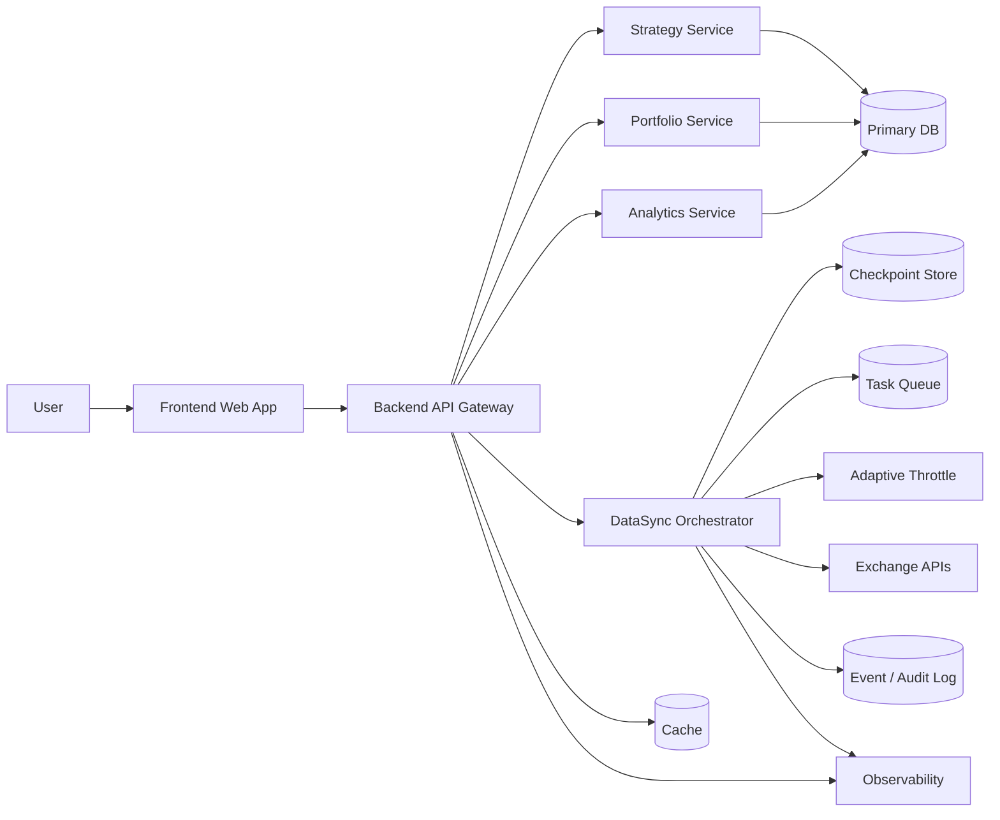
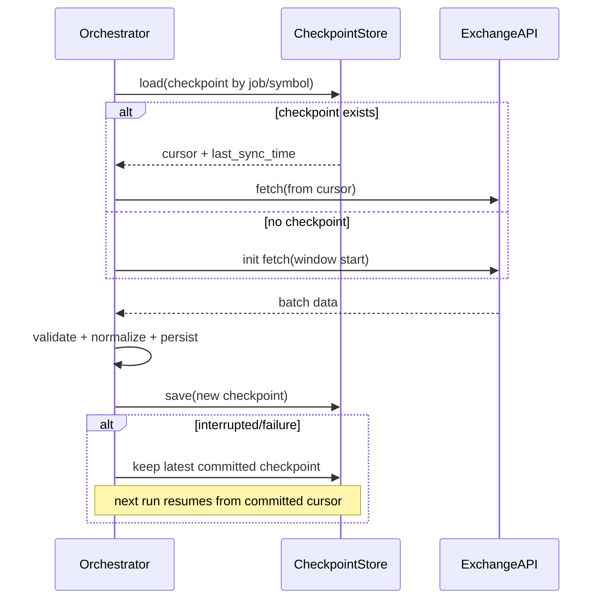
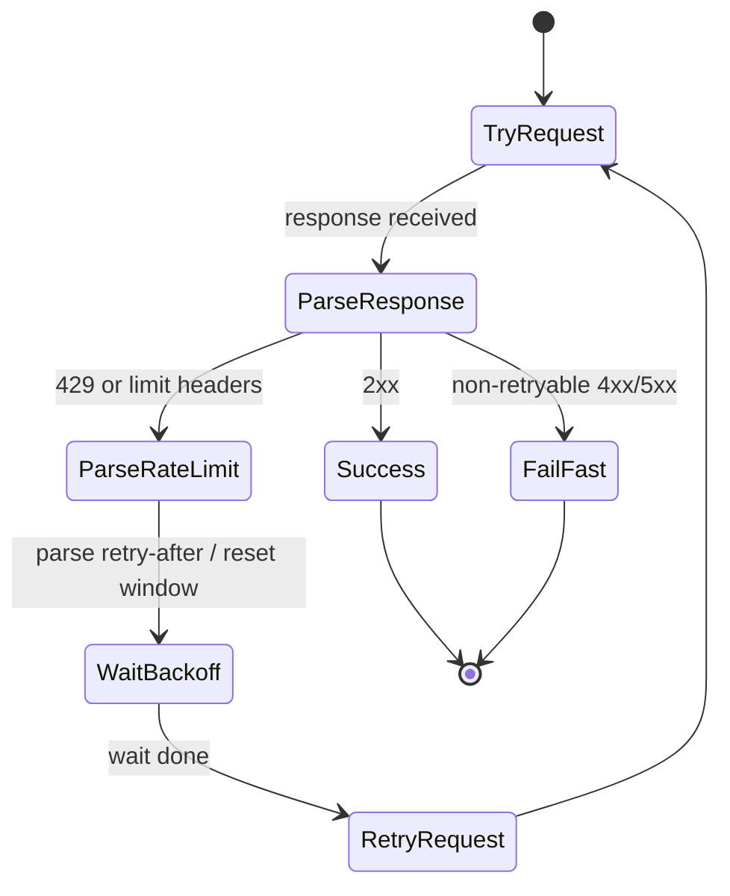
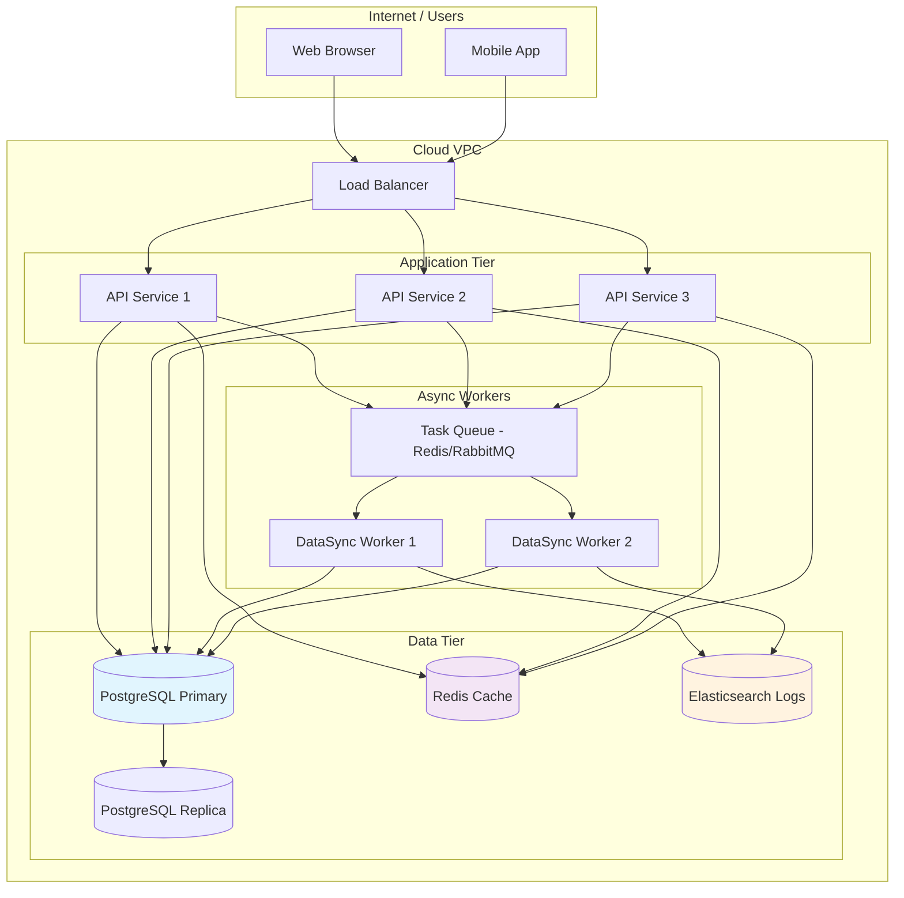

# SYSTEM_ARCHITECTURE

Status: Final (P0-ARC-001)
Last Updated: 2026-03-09 (UTC)
Owners: @designer, @coder, @writer

## 1. Scope and Baseline

This document is the single merged architecture source for TraderMate.

- Phase 7 is removed from scope.
- This draft provides architecture skeleton + Mermaid main diagram v1 + terminology table.
- Detailed sections (NFR mapping, DR, observability, deployment hardening) will be filled in the next iteration.

## 2. System Context

TraderMate is a layered system:

- Frontend: Web client (UI + strategy workflows)
- Backend API: domain services + orchestration
- DataSync Engine: exchange sync with checkpoint/resume + adaptive throttle
- Data Layer: relational DB + cache + event/log store
- External Dependencies: exchange APIs and infra services

## 3. Main Architecture Diagram (v1)



## 4. DataSync Sequence (init -> checkpoint -> resume)



## 5. Adaptive Throttle State Diagram (try -> parse -> wait -> retry)



## 6. Terminology Table (v1)

| Term | Definition | Notes |
| --- | --- | --- |
| checkpoint | Persisted sync progress snapshot for a job partition. | Includes cursor and sync metadata. |
| cursor | Opaque position token from exchange/API pagination or stream offset. | Used to continue incremental sync. |
| retry-after | Server-provided wait hint (seconds/timestamp) for retry after rate limiting. | Preferred over fixed backoff when present. |
| adaptive throttle | Runtime rate control based on API feedback and configured limits. | Balances throughput and ban-risk. |
| resume | Restarting sync from last committed checkpoint after interruption. | Guarantees forward progress with idempotency rules. |

## 7. Service Boundaries and Ownership Matrix

| Service | Owner Team | Primary Responsibilities | Key Interfaces | Data Store |
| ------- | ---------- | ------------------------ | -------------- | ---------- |
| Frontend Web App | @writer/@designer | UI rendering, user interactions, strategy configuration | Backend API Gateway | N/A (client-side cache) |
| Backend API Gateway | @coder | Request routing, authentication, rate limiting, API composition | All domain services, Cache | N/A (stateless) |
| Strategy Service | @coder | Strategy lifecycle, parameter validation, backtest execution | Primary DB, Portfolio Service | Primary DB (strategies, results) |
| Portfolio Service | @coder | Position tracking, P&L calculation, risk metrics | Primary DB, Analytics Service | Primary DB (positions, trades) |
| Analytics Service | @coder | Reporting, metrics aggregation, data export | Primary DB, Cache, Event Log | Primary DB + Cache |
| DataSync Orchestrator | @coder | Exchange data synchronization, checkpoint management | Exchange APIs, Checkpoint Store, Task Queue | Checkpoint Store, Event Log |
| Observability | @operator | Metrics collection, logging, alerting | All services (instrumented) | Event / Audit Log |

**Ownership Notes:**
- @coder owns all backend services and data layer integration
- @writer owns documentation and user-facing guidance for all services
- @operator owns deployment, monitoring, and operational aspects
- @designer owns system-level architecture decisions and diagram maintenance

---

## 8. Non-Functional Requirements (NFR) Mapping

| NFR Category | Target | Architecture Support | Verification Method |
| ------------ | ------ | -------------------- | ------------------- |
| **Latency** | API p95 < 200ms (reads)<br>API p95 < 500ms (writes) | Caching layer for read-heavy operations<br>Async processing for non-critical writes | Load testing, APM metrics |
| **Reliability** | 99.9% uptime (excl. exchange outages)<br>Max 1h MTTR | Stateless API services<br>Database connection pooling<br>Graceful degradation | Chaos testing, incident post-mortems |
| **Scalability** | Support 1000 concurrent users<br>Process 1M+ market data points/day | Horizontal scaling of API services<br>Queue-based async processing<br>Checkpoint-based sync parallelism | Capacity planning, load testing |
| **Data Consistency** | Eventually consistent across services<br>No lost sync data | Checkpoint persistence<br>Idempotent operations<br>Event sourcing for audit | Sync recovery tests, data integrity checks |
| **Security** | Encrypted transit (TLS 1.3)<br>Secrets rotation automated<br>No plaintext credentials in logs | API gateway auth<br>Secret management service<br>Structured logging with scrubbing | Security audit, penetration testing |

---

## 9. Deployment Topology and Environment Differences

### 9.1 High-Level Deployment Diagram



### 9.2 Environment Differences

| Aspect | Development | Staging | Production |
| ------ | ----------- | --------| ---------- |
| **Instance Count** | 1 (all services) | 2-3 per service | 3+ per service (auto-scaling) |
| **Database** | Single instance, no replica | 1 primary + 1 replica | Primary + 2 replicas + read replicas |
| **Cache** | Local Redis (docker) | Managed Redis cluster | Redis cluster with persistence |
| **Task Queue** | Local Redis (dev mode) | Managed queue service | RabbitMQ/Redis cluster with HA |
| **Observability** | Console logs only | Basic metrics collection | Full APM + custom dashboards + alerts |
| **Secrets Management** | .env files (gitignored) | Encrypted vault (staging) | HSM-backed secrets manager |
| **CI/CD** | Manual git pull | Automated PR → staging | Automated rollout with canary |
| **Exchange API Keys** | Sandbox/test keys | Separate test keys | Production keys with rate limits |
| **Backup Strategy** | Manual dumps | Daily automated backups | Real-time replication + point-in-time recovery |

### 9.3 Deployment Package Structure

```
tradermate/
├── docker-compose.yml          # Dev environment
├── kubernetes/
│   ├── namespaces/
│   ├── deployments/
│   ├── services/
│   └── configmaps/
├── helm/
│   └── tradermate/
│       ├── Chart.yaml
│       ├── values.yaml
│       └── templates/
├── scripts/
│   ├── deploy.sh              # Multi-env deployment wrapper
│   ├── rollback.sh            # Automated rollback
│   └── health-check.sh        # Post-deploy validation
└── .env.example               # Environment template
```

---

## 10. DR & Security Overview

**Note**: Detailed security controls to be expanded in separate SECURITY.md. This section provides high-level DR and security coverage.

### Disaster Recovery (DR)

| Aspect | Specification |
| ------ | --------------- |
| **Backup Strategy** | Daily automated full backups (DB + file storage) with point-in-time recovery capability |
| **Recovery Time Objective (RTO)** | ≤ 4 hours to restore core services from backup |
| **Recovery Point Objective (RPO)** | ≤ 1 hour data loss (based on backup frequency + transaction logs) |
| **Backup Retention** | 30 days of daily backups + weekly/monthly archives |
| **Restore Testing** | Monthly disaster recovery drill to validate backup integrity |
| **Geographic Redundancy** | Backups stored in separate availability zone/region |

### Security Controls

| Control Area | Current Implementation | Gaps / Future Work |
| ------------ | ----------------------| ------------------ |
| **Authentication** | API key + session token | OAuth2 / SSO integration |
| **Authorization** | Role-based (admin/user) | Fine-grained resource permissions |
| **Secrets Management** | Environment variables (dev) / Vault (prod) | Automated rotation, audit logging |
| **Input Validation** | Basic schema validation | Comprehensive anti-injection, CSP |
| **Logging** | Structured JSON logs | Sensitive data scrubbing, PII masking |
| **Network** | TLS 1.3 enforced | Network segmentation, WAF rules |
| **Database** | Connection encryption at rest | Column-level encryption for PII |
| **Compliance** | No formal compliance | SOC2 / GDPR roadmap |

**Key Security Touchpoints:**
- All external APIs called over HTTPS with certificate validation
- Secrets never logged (structured logging filters)
- Database connections use SSL/TLS
- Admin endpoints protected by strong authentication
- Regular security scans integrated into CI

---

## 11. Remaining Work (Post-Heartbeat)

The following items require further development or collaboration:

- **Failure Domain Analysis** - Detailed failure scenario mapping and mitigation strategies.
- **Security Controls Detail** - Expand SECURITY.md with rotation procedures, incident response, and compliance mappings.
- **Observability Integration** - Document metrics, logs, and traces schema; define SLOs and alert thresholds.

These are deferred to next design iteration or require input from @coder and @operator.

---

## 12. Change Notes (this draft)

- Created single merged architecture document `SYSTEM_ARCHITECTURE.md`.
- Added Mermaid main architecture diagram v1.
- Added datasync sequence and adaptive throttle state visualization.
- Added terminology table to normalize checkpoint/cursor/retry-after usage.
- **2026-03-09**: Added service ownership matrix, NFR mapping, deployment topology, and security overview. Filling open items per acceptance criteria.
