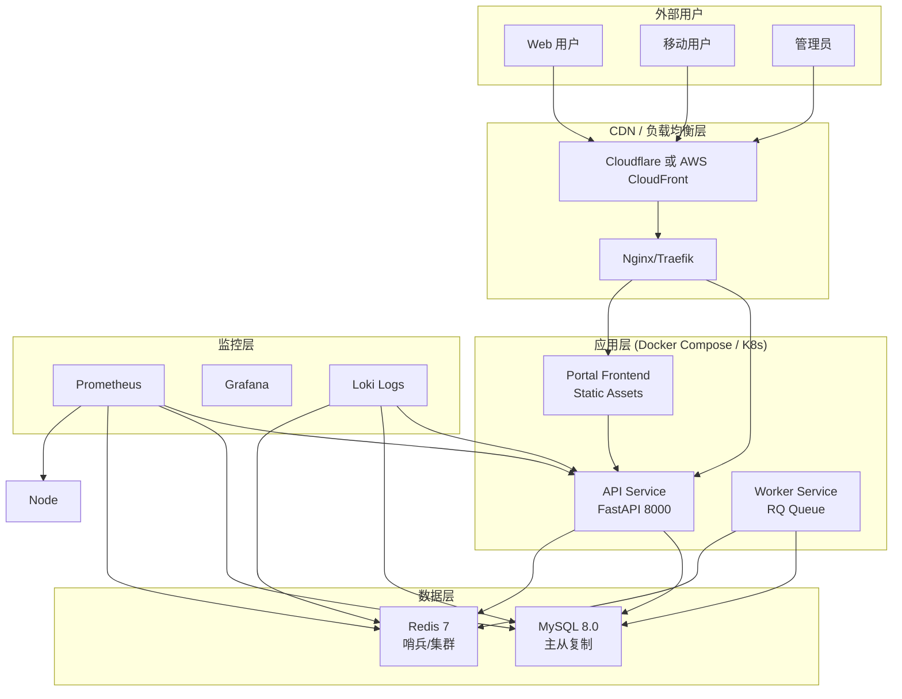
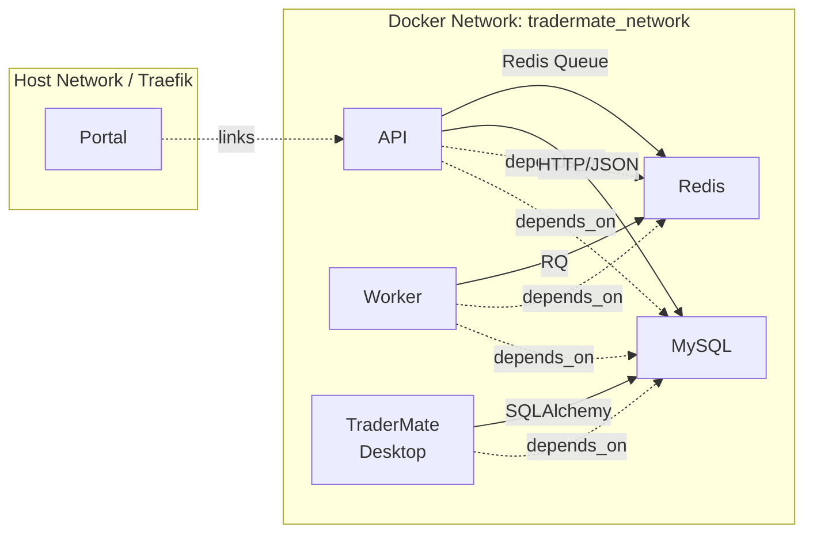
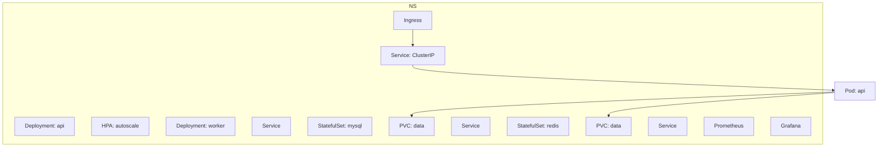
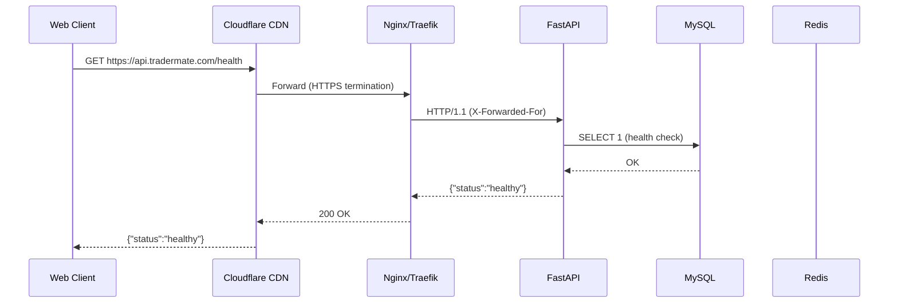
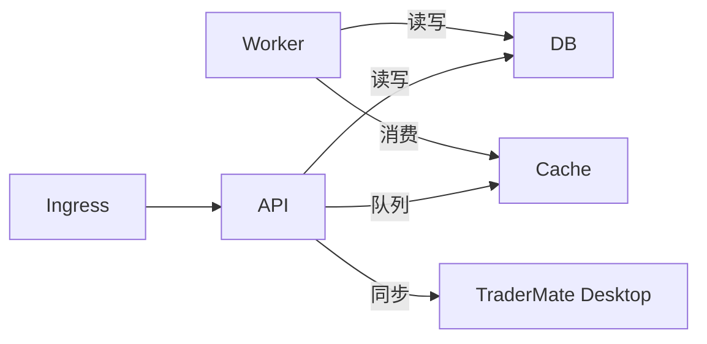
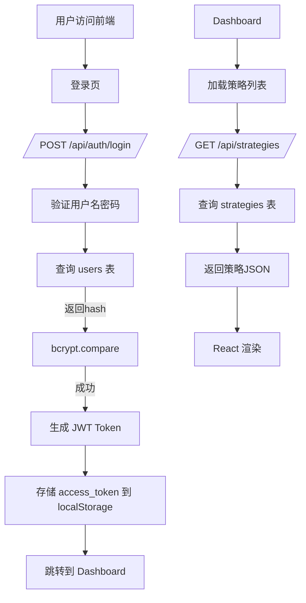
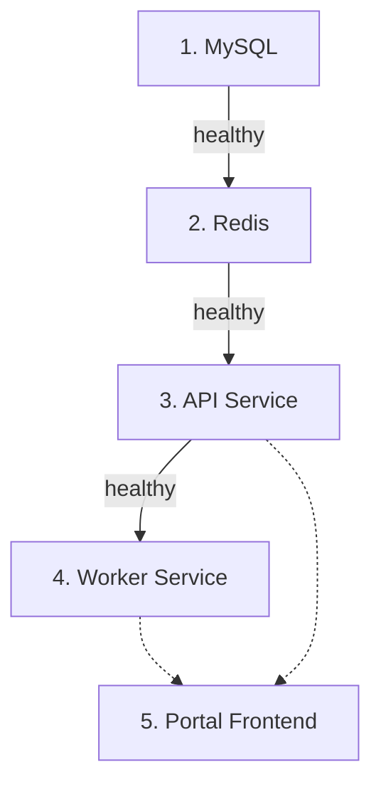
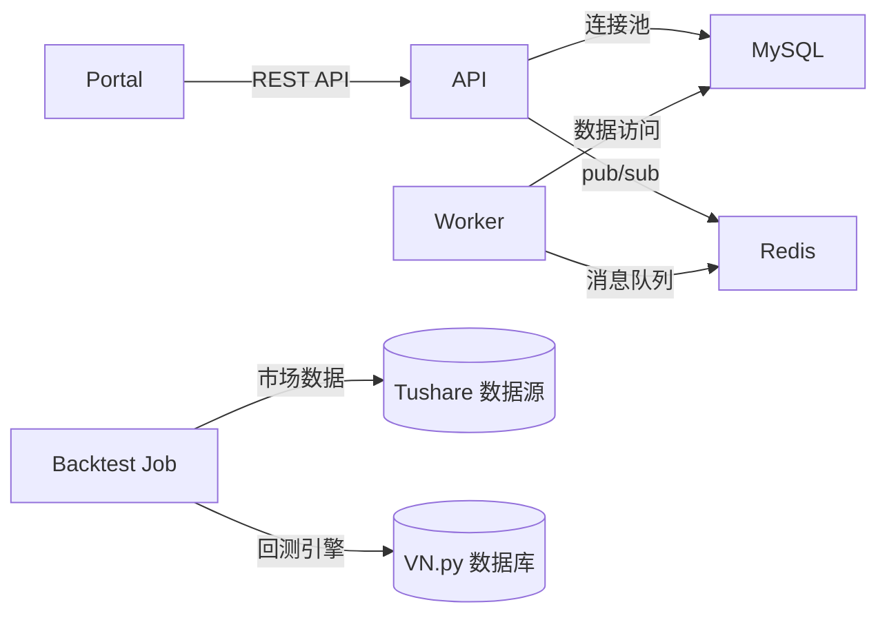
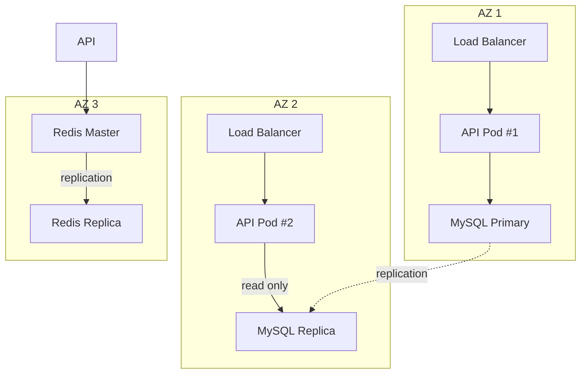
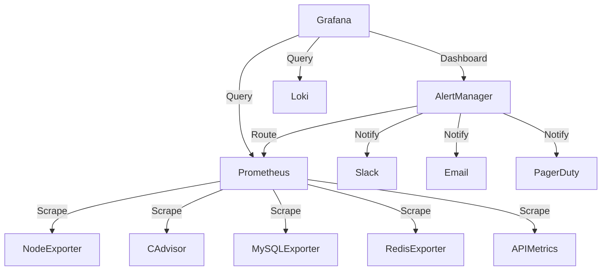

# TraderMate 生产环境架构图

**版本**: 1.0  
**最后更新**: 2026-03-03

---

## 目录

1. [整体架构图](#整体架构图)
2. [Docker Compose 部署架构](#docker-compose-部署架构)
3. [Kubernetes 部署架构](#kubernetes-部署架构)
4. [网络流量图](#网络流量图)
5. [数据流图](#数据流图)
6. [组件依赖关系](#组件依赖关系)

---

## 整体架构图

### 架构概览 (Level 1)



---

## Docker Compose 部署架构

### 服务拓扑



### 端口映射

| 服务 | 容器端口 | 主机端口 | 说明 | 生产建议 |
|------|----------|----------|------|----------|
| api | 8000 | 80 (Traefik) | REST API | 不直接暴露，通过 Ingress |
| portal | 80 | 443 (Traefik) | Nginx 前端 | 仅 HTTPS |
| mysql | 3306 | (none) | 数据库 | 禁止公网 |
| redis | 6379 | (none) | 队列 | 禁止公网 |

---

## Kubernetes 部署架构

### 命名空间与资源



### Pod 调度策略

```yaml
apiVersion: v1
kind: Pod
metadata:
  name: tradermate-api
spec:
  nodeSelector:
    role: app
  tolerations:
  - key: "production"
    operator: "Equal"
    value: "true"
    effect: "NoSchedule"
  containers:
  - name: api
    resources:
      requests:
        memory: "512Mi"
        cpu: "500m"
      limits:
        memory: "1Gi"
        cpu: "1000m"
```

---

## 网络流量图

### 用户请求路径



### 内部通信



---

## 数据流图

### 用户登录与策略管理



### 回测任务流程

```mermaid
flowchart LR
    UI[Frontend UI] -->|submit| API1[POST /api/queue/backtest]
    API1 -->|push job| Redis[(Redis Queue)]
    API1 -->|save to| DB[(MySQL backtest_history)]

    Worker[RQ Worker] -->|pop job| Redis
    Worker -->|execute| VNPY[VeighNa Backtest Engine]
    VNPY -->|read data| TushareDB[(Tushare DB)]
    VNPY -->|write result| DB
    Worker -->|update status| Redis
    Worker -->|notify| WebSocket[WebSocket (可选)]

    UI -->|poll| API2[GET /api/backtest/{job_id}]
    API2 --> DB
    API2 --> UI

    UI -->|display| Charts[回测图表]
```

---

## 组件依赖关系

### 启动顺序依赖



**说明**:
- API 和 Worker 依赖 MySQL + Redis
- Portal 仅依赖 API (可以独立启动)
- 健康检查 `depends_on.condition: service_healthy` 确保顺序

### 运行时数据依赖



---

## 容灾架构 (多可用区)

### 高可用部署 (可选)



**故障转移**:
- API 实例无状态，多副本自动负载均衡
- MySQL 使用 Orchestrator 或 MHA 自动 failover
- Redis 使用 Sentinel 自动故障转移

---

## 监控覆盖范围



---

**文档结束**

> **提示**: 以上图表使用 Mermaid 语法，可在支持 Mermaid 的 Markdown 编辑器（如 GitHub、GitLab、Obsidian）中可视化。如需 PNG/SVG 导出，使用 Mermaid CLI 或在线工具。
